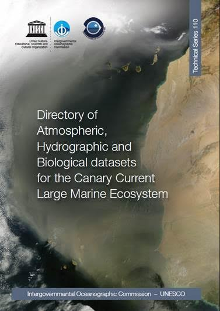
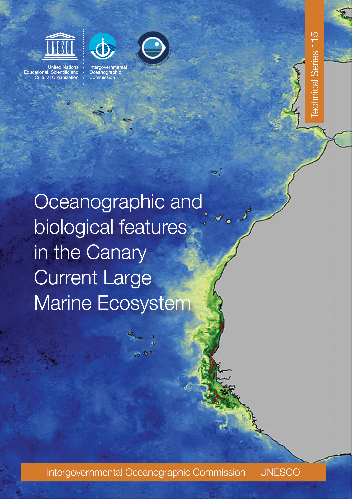

# IOC-UNESCO WORKSHOP CAPE VERDE
Repository to Share Code and Resources

## Index
* [Documentation](#Documentation)
* [Presentations](#Presentations)
* [Resources](#Resources)
* [First Ideas](#First Ideas)

## How use it

Just clone this repository in your local machine:
https://github.com/lmagudo/IOC-UNESCO_WORKSHOP.git

And you are ready to edit and update this repository and the code:
```javascript
var ArcNode = require('arc-node'),
    service = new ArcNode(<config object>);
```
Check here  *[GitHub Tutorials](https://guides.github.com/)* to learn about GitHub.

### Documentation
* [AGENDA IOC-UNESCO Workshop](AGENDA_WORKSHOP.pdf)
* [Directory of Atmospheric, Hydrographic and Biological datasets for the Canary Current Large Marine Ecosystem](http://unesdoc.unesco.org/images/0023/002314/231430E.pdf)


* [Oceanographic and biological features in the Canary Current Large Marine Ecosystem](http://unesdoc.unesco.org/images/0023/002332/233299E.pdf)



### Presentations
* [Workshop Agenda Organization_Itahisa Deniz](Presentations/Presentation_ Workshop_agenda_organization.pdf)
* [Workshop on Update of metadata, data availability and application needs for a CCLME Eco-GIS viewer](https://slides.com/lmagudo/workshop-on-update-of-metadata-data-availability-and-application-needs-for-a-cclme-eco-gis-viewer)
* [Presentation of the Prototype of the CCLME Eco-GIS Viewer and prospects of needs for applications_Luis Miguel Agudo](Presentations/Presentation_Prototype_CCLME_Eco-GIS_Viewer.pdf)
* [Current state of geoprocessing development on the web applications_Luis Miguel Agudo](Presentations/Presentation_Current_State_Geoprocessing_Development_Web_Applications.pdf)
* [GIS applications, spatial modelling and open data portal_Ana Barbosa](Presentations/PPT_IOC_UNESCO_MPR_NOV2015_BARBOSA__V3.pdf)
* [FAO role and experiences in spatial data analysis supporting fisheries_Fabio Carocci](Presentations/Presentation_FAO_role_experiences_spatial_data_analysis_supporting_fisheries.pdf)
* [IEO Spatial Data Infrastructure_Olvido Tello](Presentations/Presentation_IEO.pdf)
* [SHOM public platform for GIS data (data.shom.fr portal)_Nathalie Leidinger](Presentations/Presentation_shom.pdf)

### Resources
* [ArcNode for ArcGIS](https://github.com/esri-es/ArcNode) Node module to work with ArcGIS Online and ArcGIS Server.
* [Upwelling Index -  RAIA project](http://www.indicedeafloramiento.ieo.es/afloramiento_en.html) Upwelling index time series provided by the Instituto Español de Oceanografía. This index was calculated using sea level pressure of the Meteogalicia WRF atmosferic model.
* [CVOO - Cape Verde Ocean Observatory] (http://cvoo.geomar.de/index.php?id=85)
* [Particularly Sensitive Sea Areas](http://www.imo.org/en/OurWork/Environment/PSSAs/Pages/Default.aspx)

### First Ideas
[New Ideas for analysis and visualization tools](New Ideas for analysis and visualization tools.docx)
